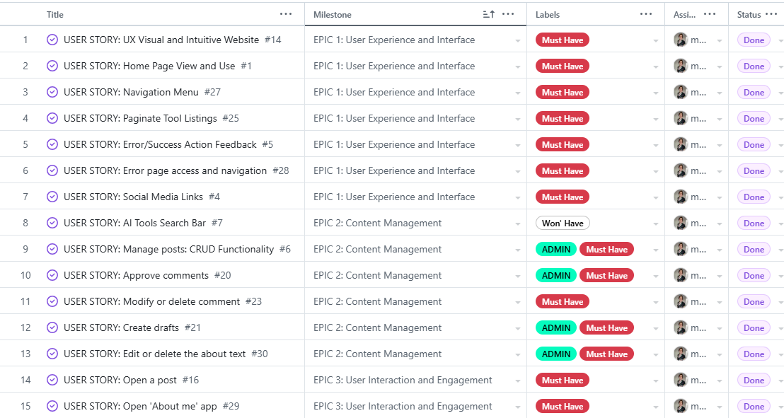
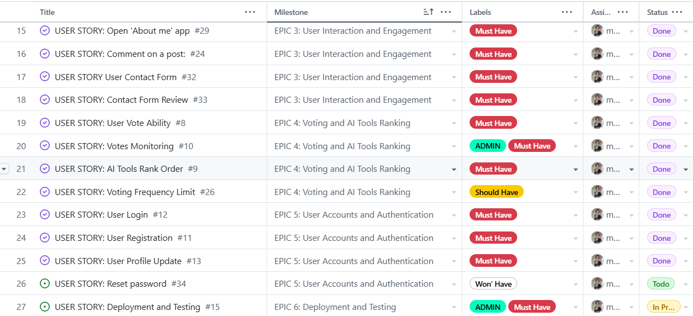
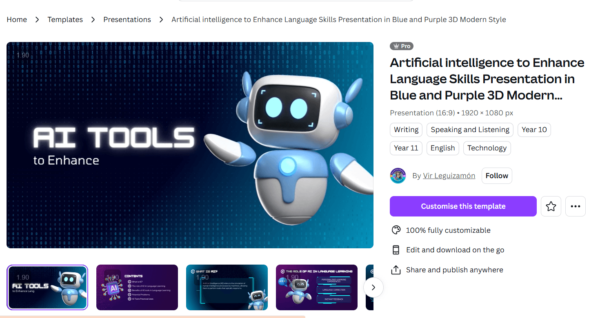
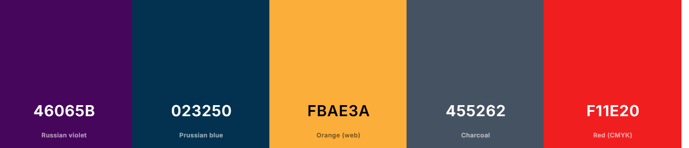
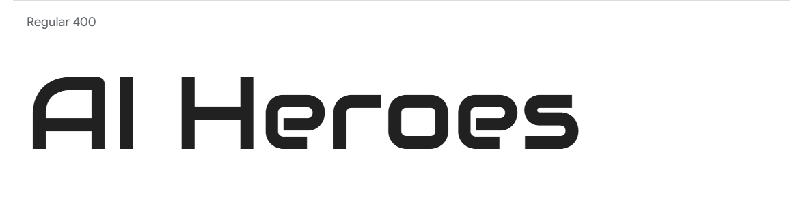

# AI Heroes

Here is a link to the live project: [AI Heroes](https://ai-heroes-blog-d4716b80dc08.herokuapp.com/)

AI Heroes is a platform designed to demystify AI by showcasing powerful, user-friendly AI tools that improve daily life efficiency and productivity. The website aims to bridge the gap for users familiar with the term "AI" but seeking practical, accessible examples of its use.

## Contents

- [User Experience (UX)](#user-experience-ux)
   * [User Stories](#user-stories)

- [Design](#design)
   * [Colour Scheme](#colour-scheme)
   * [Typography](#typography)
   * [Imagery](#imagery)
   * [Wireframes](#wireframes)
   * [Database Schema](#database-schema)

- [Features](#features)
   * [Home Page](#home-page)
   * [AI Tools Page](#ai-tools-page)
   * [Voting and Ranking](#voting-and-ranking)
   * [About Page](#about-page)
   * [Contact Page](#contact-page)
   * [Features to Add](#features-to-add)

- [Technologies](#technologies)
   * [Languages Used](#languages-used)
   * [Libraries & Programs Used](#libraries-and-programs-used)

- [Testing](#testing)

- [Deployment](#deployment)
   * [Deployment Process](#deployment-process)
   * [Forking](#forking)
   * [Clone](#clone)

- [Credits](#credits)
   * [Code](#code)
   * [Media](#media)

---

## User Experience (UX)

AI Heroes visitors are individuals curious about AI, eager to explore its applications through straightforward examples and easy-to-understand explanations. They are looking for insights and guidance into the best AI tools available.

## User Stories

A list of user stories grouped into epics for better structure and clarity.

### EPIC | User Experience and Interface
- As a visitor, I want the website to be visually appealing and easy to navigate so that I have an enjoyable experience while exploring AI tools.
- As a visitor, I want to view the homepage so that I can learn about the website and the AI tools it features.
- As a visitor, I can navigate the website with ease so that I have an enjoyable experience exploring AI tools.
- As a user, I want to see tools in paginated format so that I don’t have to scroll through a long list of tools.
- As a visitor, I want to receive feedback (success/error messages) after completing actions so that I understand the outcome of my interaction.
- As a visitor, I want to access an error page with an option to navigate back to the homepage.
- As a visitor, I want to see social media links to follow the project and its author online. 

### EPIC | Content Management
- As an admin, I want to create, read, update, and delete posts so that I can easily manage my page content.
- As a Site Admin, I can approve or disapprove comments so that I can only display relevant topics.
- As a Site User, I can modify or delete my comment on a post so that I can be involved in the conversation.
- As a Site Admin, I can create draft posts so that I can finish writing the content later.
- As a Site Admin, I can create, update, or delete the about page content so that it is available on the site.

### EPIC | User Interaction and Engagement
- As a Site User, I am able to leave comments on a post so that I can share my opinion on the topic.
- As a user, I can view the comments so that I can be up to date with the recent engagement.
- As a Site User, I am able to click on the About link so that I can read the content of the site.
- As a user, I want to be able to send a message to the site owner so that I can address my query to the relevant people.
- As an admin, I can read the message sent by the user so that I can have a better understanding of their inquiries, needs, or feedback.

### EPIC | Voting and AI Tools Ranking
- As a visitor, I want to see the AI tools ranked by popularity based on votes so that I can easily identify the top-rated tools.
- As a user, I want to vote for an AI tool so that I can express my fascination and interest.
- As an admin, I want to monitor votes to prevent misuse and ensure fair voting.
- As a user, I want to see tools in a paginated format so that I don’t have to scroll through a long list of tools.

### EPIC | User Accounts and Authentication
- As a user, I want to log in using my email and password so that I can access personalized features.
- As a user, I want to register an account using my email and password so that I can interact more deeply with the website.

### EPIC | Deployment and Testing
- As an admin, I want to deploy the website successfully so that it is accessible to users and can be included in my portfolio.

   
   

[Back to top ⇧](#ai-heroes)

## Design

- The look of this website was based loosely around The Code Institute's 'Codestar' wlakthorguh project as well as canva's  AI template.

    

### Color Scheme

- **Primary Colors**:  
  The website uses a futuristic combination of deep blues, purple and  grey on a white background to create a clean and modern aesthetic. These colors reflect the technological theme while maintaining readability and simplicity.

- **Accent Colors**:  
  Bright accents like orange and purple are used to draw attention to interactive elements, such as buttons and links, enhancing the user experience and reinforcing the AI theme.

  

### Typography
- The **Audiowide** font is used as the primary typeface, chosen for its retro style that complements the futuristic and technological concept of AI Heroes. It gives the site a unique personality while remaining readable and visually appealing

    

### Imagery
- The **main image** features a matrix-style blue background with a superhero robot flying across, representing the fusion of futuristic ideas and AI technology.

- **Illustrative Elements**:  
  Additional robot-themed images are used throughout the site to emphasize the blog's core theme. For example:
  - A robot holding a trophy symbolizes the leaderboard and the ranking of AI tools, highlighting hierarchy and competition. 
  
  - Futuristic visuals and icons help maintain consistency with the blog's modern AI narrative.

  
  
These design choices work together to immerse visitors in the world of AI while keeping the interface clean and engaging.

### Wireframes

### Database Schema 

[Database Schemas](/documentation/erd_schema.png)

[Back to top ⇧](#ai-heroes)

## Features

### Home Page

- **Navigation Bar**:  
  A responsive navigation bar is present across all pages, providing easy access to key sections such as Home, Leaderboard, About, and Contact. The navigation bar includes links to login and register for imediate action and engagement.

- **Welcome Back message**
  A short message welcoming user back once they had logged in is displayed on the right side of the screen, to add personal touch and friendly manner.

- **Hero Section**:  
  A visually striking hero section welcomes users with a title and a brief explanation of the website's purpose. This section draws attention to AI Heroes' mission of making AI accessible and practical for everyday use.

- **Introductory Content**:  
  A dedicated section introduces users to the voting feature and invites them to explore the leaderboard. This section explains the purpose of voting and encourages users to participate by casting votes for their favorite AI tools.

- **Card Display Format**:  
  AI tools are presented in a card format, each card featuring:
  - Tool Name
  - A brief description
  - Created date
  - Voting buttons to express user preference.

- **Pagination**:  
  Tools are paginated, with six tools on each page displayed making it a manageable isplayed , ensuring optimal readability and navigation.

- **Footer**:
  The footer rests at the bottom of each page and has links to all social media accounts.Clicking the links in the footer opens a separate browser to avoid pulling the user away from the site.

### Voting and Ranking

- **Voting Mechanism**:  
  Users can vote on their favourite tools by clicking a vote button on each tool card.

- **Dynamic Ranking**:  
  Tools are ranked based on the number of votes they receive, helping users identify the most popular and impactful tools.

- **Vote Monitoring**:  
  Admin can monitor and manage votes to ensure fair play and prevent misuse.

### Tools Details Page

The **Tools Details Page** provides users with in-depth information about each AI tool, showcasing its unique features, capabilities, and impact. This page is designed to engage users by presenting a clean and intuitive interface, encouraging interaction through comments and voting.

- **Card Layout**:  
  Each tool is displayed in a well-organized card format, including the following details:
  - **Tool Logo Card**: Highlighted prominently at the top for easy identification.
  - **Displayed Voting Count**: Allows users to upvote their favorite tools, with the total votes displayed clearly. This icon is clickable and brings user to the voting sector in home page. 
  - **Displayed Comment Count**: This icon is also clickable and brings user to the commnet section. 
  - **Creation Date**: Provides transparency about when the tool was added to the platform.
  - **Description**: Includes a detailed overview of the tool’s capabilities, focusing on its unique impact and use cases.
  - **Key Features**:
  - **Revolutionary Impact**
  - **What Makes It Special**
    - A dedicated section explains what makes the tool stand out from its competitors, emphasizing strengths such as performance, usability, or innovation.
  - **Why You Should Try It**: A short, user-friendly summary outlining the tool's ideal use cases, target audience, and ease of use. Key points include:
    - Star rating for ease of use.
    - Notable advantages, such as professional-grade outputs, intuitive interfaces, and context understanding.

- **Interactive Elements**:
  - **Comments Section**: Enables users to leave feedback or insights about their experience with the tool. 
    - Users can post comments after logging in, fostering community engagement and discussions.
    - Comments include success/error messages for transparency.
    
    - once commented, message"awaiting approval" is displayed. 
    
  - **Voting Feature**: Allows logged-in users to vote directly for their favorite tools, influencing the leaderboard rankings.

- **Footer**:
  - Credits the creator, ensuring recognition for development efforts.
  - Includes social media links to encourage further engagement and connection.

This page emphasizes user interaction and engagement by combining informative content with intuitive, user-friendly features.

### Leaderboard

The Leaderboard feature in AI Heroes serves as an engaging and dynamic way to showcase the most popular AI tools based on user votes. This functionality encourages user participation and provides valuable insights into community preferences.

- **Purpose:**
  - Highlight Popularity: The leaderboard ranks AI tools by the number of votes they receive, making it easy for visitors to identify top-rated and impactful tools.
  - Encourage Engagement: Visitors are motivated to explore, vote for, and interact with AI tools to influence the rankings.
  - Transparency: The voting mechanism ensures that rankings reflect genuine user interest and enthusiasm.
- **Key Features:**
  - Real-Time Updates: The leaderboard dynamically adjusts as votes are cast, providing up-to-date rankings of AI tools.
  - Clear Display: The tools are ranked in descending order of votes, with the most popular tools appearing at the top.

### About & Contact Page

The **About & Contact page** is designed to foster meaningful connections and encourage user engagement by combining two essential sections: the introduction of the blog owner and an easy way to reach out. By merging these sections, users who visit to learn more about the blog are naturally presented with the opportunity to communicate, and those seeking to contact the owner are more likely to read the "About" section, creating a stronger sense of connection.
- **Purpose Highlight**: 
  The page introduces the blog owner and outlines the mission and vision of AI Heroes, highlighting the importance of making AI tools accessible and useful to everyone. Immediately below the "About" section, users can find the contact form, simplifying the process of reaching out.

- **Visuals**:
  A profile image of the blog owner is prominently displayed, adding a personal touch and helping to establish trust and rapport with the audience. 
- **Contact Form**:  
  The contact form is straightforward, allowing users to easily send queries or feedback. The form includes:
  - Name
  - Email
  - Message

- **Feedback Messages**:  
  After submitting the form, users receive clear feedback with success or error messages, ensuring they understand the outcome of their inquiry and feel reassured their communication has been handled properly.

### Features to Add
- **Tool Recommendations**:  
  A recommendation engine to suggest AI tools based on user preferences or browsing history.

- **User Profiles**:  
  Allow users to create accounts, save their favorite tools, and manage their interactions on the site.

- **Password Reset** 
  Allow user to reset password from the dashboard. 

- **Search and Filtering**:  
  Enhanced search functionality with filtering options to sort tools by categories, popularity, or user ratings.

- **Social Media Integration**:  
  Options to share AI tools directly on social media platforms.

[Back to top ⇧](#ai-heroes)

## Responsiveness (Main Pages)

  

  
Home Page

  
  
  
  

  

  
Post Detail Page

  - 
  - 
  - 
  

  

  
Leaderboard

  - 
  - 
  - 
  

  

  
About & Contact Page

  - 
  - 
  - 
  

 
## Technologies

### Languages used

- [HTML5](https://en.wikipedia.org/wiki/HTML5)
- [CSS3](https://en.wikipedia.org/wiki/Cascading_Style_Sheets)
- [Javascript](https://en.wikipedia.org/wiki/JavaScript)
- [Python](https://www.python.org/)

### Libraries and Programs Used

- [Git](https://git-scm.com/)
- Version control.
- [GitHub](https://github.com/)
    - For storing code and deploying the site.
- [Gitpod](https://www.gitpod.io/)
    - Used for building and editing my code.
- [Django](https://www.djangoproject.com/)
    - A python based framework that was used to develop the site.
- [Bootstrap](https://getbootstrap.com/)
    - For help designing the html templates.
- [Google Fonts](https://fonts.google.com/)
    - Used to style the website's logo.
- [Font Awesome](https://fontawesome.com/)
    - Used to obtain the icons used.
- [Google Developer Tools](https://developers.google.com/web/tools/chrome-devtools)
    - Used to help fix problem areas and identify bugs.
- [Cloudinary](https://cloudinary.com/)
    - Used to store static files and images.
- [Favicon.io](https://favicon.io/)
    - Used to generate the site's favicon.
- [SQlite](https://www.sqlite.org/index.html)
    - Used when performing unit tests.
- [PostgreSQL](https://www.postgresql.org/)
    - Database used through heroku.
- [Lucidchart](https://www.lucidchart.com/)
    - To draw out the database schema.
- [W3C Markup Validation Service](https://validator.w3.org/) 
    - Used to validate HTML code.
- [W3C CSS Validation Service](https://jigsaw.w3.org/css-validator/#validate_by_input)
    - Used to validate CSS code.
- [Pep8](http://pep8online.com/)
    - Used to validate Python code.
- [JSHint](https://jshint.com/)
    - Used to validate JS code.
- [Summernote](https://summernote.org/)
    - Used to add a WYSIWYG text box to the add recipe page.
- [Tinyjpg](https://tinyjpg.com/)
    - Used to compress images.
- [Heroku](https://www.heroku.com/)
    - To deploy the project.
- [Canva](https://www.canva.com/)
    - Used for robot and  background images as well as wireframes and inspiration
- [ChatGPT](https://chatgpt.com/)
    - Used for general queries and quick help.
- [ YouTube](https://www.youtube.com/) for tutorials and other learnigs. 
- [remove.bg](https://www.remove.bg/) to remove background

[Back to top ⇧](#ai-heroes)

## Testing 

Testing and results can be found [here](TESTING.md)

## Deployment

This project was deployed using Github and Heroku.

- ### Github 

    To create a new repository I took the following steps:

    1. Logged into Github.
    2. Clicked over to the ‘repositories’ section.
    3. Clicked the green ‘new’ button. This takes you to the create new repository page.
    4. Once there under ‘repository template’ I chose the code institute template from the dropdown menu.
    5. I input a repository name then clicked the green ‘create repository button’ at the bottom of the page.
    6. Once created I opened the new repository and clicked the green ‘Gitpod’ button to create a workspace in Gitpod for editing.

- ### Django and Heroku

    To get the Django framework installed and set up I followed the Code institutes [Django Blog cheatsheet](https://codeinstitute.s3.amazonaws.com/fst/Django%20Blog%20Cheat%20Sheet%20v1.pdf).

    
- ### Forking

    To fork my project you must;
    1. Sign in to Github and go to my [repository](https://github.com/monika-mak/AI-Heroes-PP4)
    2. Locate the Fork button at the top right of the page.
    3. Select this. 
    4. The fork is now in your repositories.

- ### Clone
    To clone my project you must;

    1. Sign in to Github and go to my [repository](https://github.com/monika-mak/AI-Heroes-PP4)
    2. Above the list of files click the green ‘code’ button.
    3. This will bring up a few options as to how you would like to clone. You can select HTTPS, SSH or Github CLI, then click the clipboard icon to copy the URL.
    4. Open git bash
    5. Type ‘git clone’ and then paste the URL you copied. Press Enter.

    For more information on cloning check out the github documentation [here](https://docs.github.com/en/repositories/creating-and-managing-repositories/cloning-a-repository)

## Credits

### Code

 -  I learnt how to ..... [youtube](link).

 ### Media

 - Majority of the images were taken from [canva](https://www.canva.com/).

 ### README 
 - README and Testing was modeled from: 
    - [Eat-Me](https://github.com/Delboy/EatMe/blob/main/README.md)
    - [FreeFido](https://github.com/amylour/FreeFido_v2/blob/main/TESTING.md)

 ### Other
 - The [Django documentation](https://docs.djangoproject.com/en/4.0/)

### Acknowledgments:
Since I wanted to make this for the users, I made a social post on linked in asking people for opinion on their best AI tool. I got some amazing tool ideas which I had included in my project. Thank you : 
Linked-in users [ a] [b] [c] for support and involvement in my project.
Peter ... 
My mentor... 

[Back to top ⇧](#eat-me)