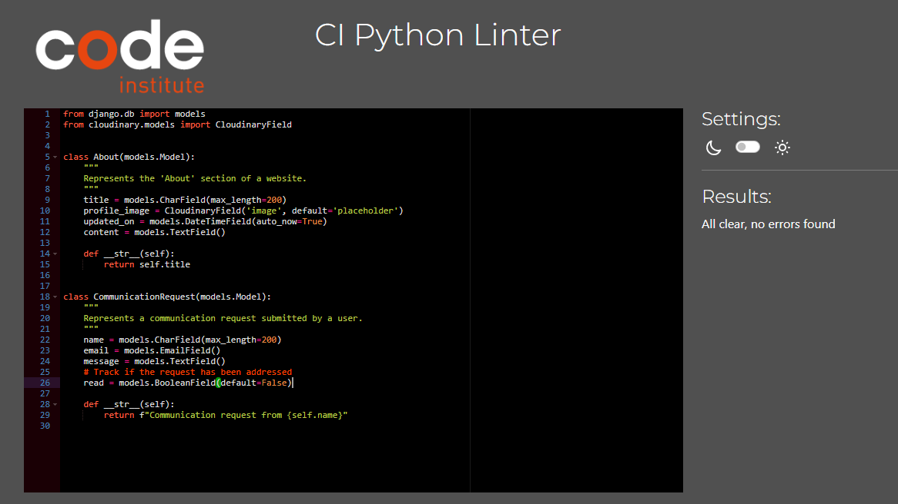
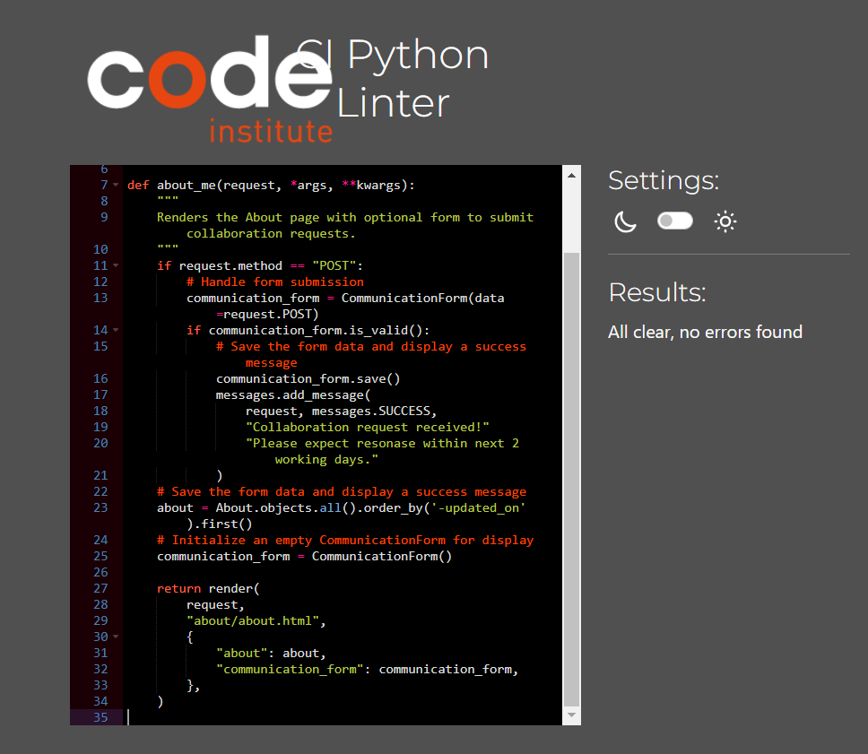

# Testing

This is the TESTING file for the [AI Heroes](https://ai-heroes-blog-d4716b80dc08.herokuapp.com/) website.

Return back to the [README.md](README.md) file.

## Testing Contents  
  
- [Testing](#testing)
  - [Testing Contents](#testing-contents)
  - [Validation](#validation)
    - [HTML Validation](#html-validation)
    - [JavaScript Validation](#javascript-validation)
    - [Python Validation](#python-validation)
    - [CSS Validation](#css-validation)
    - [Lighthouse Scores](#lighthouse-scores)
  - [Manual Testing](#manual-testing)
    - [Browser Compatibility](#browser-compatibility)
    - [Testing User Stories](#testing-user-stories)
  - [Bugs](#bugs)
    - [Known Bugs](#known-bugs)

## Validators
- HTML
    - Results of HTML official[W3C validator](https://validator.w3.org/#validate_by_input).
      
      *<i>note</i> - When validating the sign-up page the validator throws errors. These errors are caused by the installed Summernote library which runs when using the form on these pages, and as such are unable to be rectified.

      

    | HTML Source Code/Page | Pass | Errors| Warnings
    | ---- | ------ | -------- | -------- |
    | Home | Yes | 0 |0
    | Post Detail only text | Yes | 0 |0
    | Leaderboard | Yes | 0 |0
    | About & Contact| Yes | 0 |0
    | Log In | Yes| 0 |0
    | Sign out | Yes | 0 |0
    | Sing Up | NO | 1 |0
    | Error 403 | Yes | 0 |0
    | Error 404 | Yes | 0 |0
    | Error 500 |  | 0 |0

  
  

- CSS 
     - No errors were found when passing through the official [(Jigsaw) validator](https://jigsaw.w3.org/css-validator/) validator.

    

- JavaScript
    - No errors were found when passing through [Jshint](https://jshint.com/) validator.

    

- Python
    - No errors were found when passing through [CI Python Linter](https://pep8ci.herokuapp.com/#)validator.

[CI Python Linter](https://pep8ci.herokuapp.com/#) was used to validate the Python files that were created or edited by myself. No issues presented and line lengths were double checked. I have included some screenshots with the results below.

| Feature | admin.py | forms.py | models.py | urls.py | views.py |
|---------|----------|----------|-----------|---------|----------|
| About |  |  |  |  |  |
| ai_heroes | n/a |n/a|n/a | |n/a  |
| Blog |  |  |  |  |  |

  
   
### Lighthouse Scores

Lighthouse testing was carried out in Incognito mode to acheive the best results.

**Desktop**  

  
 

  
  

  

### Browser Compatibility

AI Heroes was tested on the following browsers via [Browser Stack](https://live.browserstack.com/), website loaded on below browsers with no issues. 

- Chrome v131
- Firefox v132
- Edge v131
- Safari v18
- Opera 114

### Testing User Stories
For simplicity and DRY principle, as the full list of user stories is already listed in the README [User Stories](README.md#user-stories). 

The full list of User Stories detailed inforamtion with each feature checked and tested making sure acceptance criteria were met can be acessed via [Github Project Board](https://github.com/users/monika-mak/projects/4/views/1).

### Bugs
  
- Initially my Home page had 2 errors I had trouble to solve, It had to do with the div closing tags, but they were quite tricky since using forloop made it less clear. Aloso many try and errors leading to layout change. Thankfully looking deeply into a code with some breaks I was able to allocate it. 
- Next errors were connected to the blog post and it's rendering. Since I had used chat gpt to generate blog post info, the format was not acceptable by the validator, I had removed the post and this time prompted GPT giving it correct format.  
- Page HTML were receiving a validator error of having an extra p tag, but thankfuly I was anicipating it as I came across this in our walktrough videos. Replacing it with a div solved the problem.  All valiadations were sucessfull on re-validation. 
- css error encountered due to outdated web used 
- I have confession to make, during the developmet I havent paid attention to the debug false/true. It came to my suprise that images were not loading and i spend 2 days rying to figure out what is happening, never realising that I had never collected static files. This mistake cost me a lot of confusion as not aware of it I was changing other things getting deeper and deeper into a hole. Afer reading a lot on documentation, still confused i used Claude3.5 to explain what was happenig and it gave me a really insightful understanding. Happy to repport images are working well now.  

 ### Known Bugs 
 There is an error in Sign up form, as per my research it seem to be due to the summernote and its rendering. I spend quite time trying to solve it but with no luck, will keep trying but for now the site works perfectly, sign in and out also functions without trouble. 
 
 
